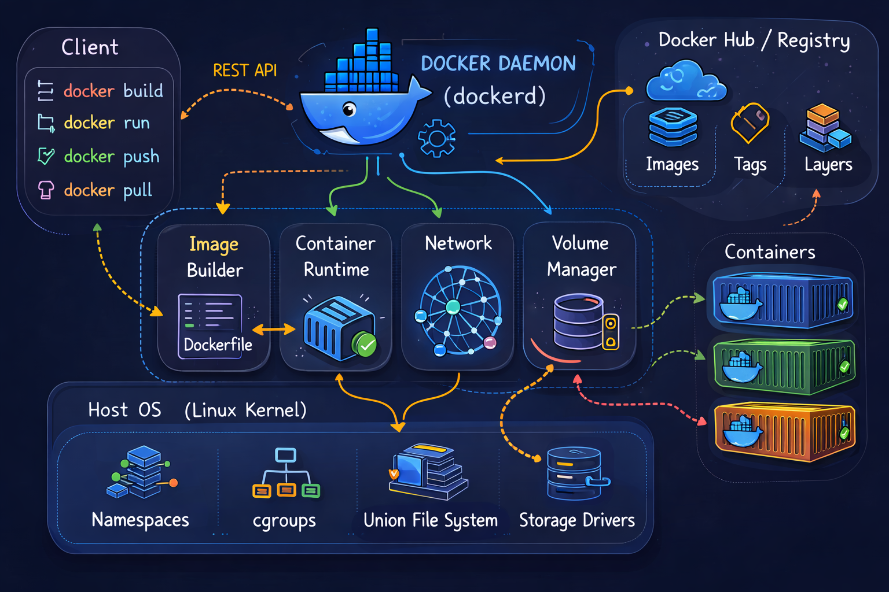

# Docker Notes

Comprehensive Docker documentation covering fundamentals, containers, images, volumes, networks, and Docker Compose.

## 📚 Contents

### 1. [Docker Fundamentals](1_docker_fundamentals.md)

Core Docker concepts and architecture:

- What is Docker and key concepts
- Docker architecture and components
- Installation and verification
- Docker images, containers, and registries
- Dockerfile instructions and best practices
- Docker volumes and networks
- Docker Compose basics
- Container lifecycle and port mapping
- Resource limits and cleanup

### 2. [Docker Containers](2_docker_containers.md)

Working with Docker containers:

- Container lifecycle and states
- Running and managing containers
- Container inspection and logs
- Executing commands in containers
- Copying files between host and container
- Resource limits and networking
- Volume mounting and environment variables
- Best practices for container design
- Common patterns and troubleshooting

### 3. [Docker Images](3_docker_images.md)

Building and managing Docker images:

- Image layers and structure
- Pulling, listing, and removing images
- Building images from Dockerfile
- Tagging and pushing images
- Image registries (Docker Hub, private)
- Saving and loading images
- Multi-architecture images
- Image optimization techniques
- Image security best practices
- Troubleshooting image operations

### 4. [Docker Volumes](4_docker_volumes.md)

Data persistence and volume management:

- Volume types and use cases
- Creating and managing volumes
- Bind mounts vs named volumes
- Volume drivers
- Backup and restore operations
- Volume best practices

### 5. [Docker Networks](5_docker_networks.md)

Container networking and communication:

- Network types (bridge, host, overlay, none)
- Creating and managing networks
- Container communication
- Port mapping and exposure
- DNS and service discovery
- Network best practices

### 6. [Docker Compose](6_docker_compose.md)

Multi-container application orchestration:

- docker-compose.yml syntax
- Services, volumes, and networks
- Environment variables and build options
- Compose commands and workflows
- Scaling services
- Compose best practices

### 7. [Docker Cheatsheet](7_docker_cheatsheet.md)

Quick reference guide for common Docker commands:

- Image commands
- Container commands
- Volume commands
- Network commands
- Compose commands
- System commands

## 🎯 Quick Start

### Installation

```bash
curl -fsSL https://get.docker.com -o get-docker.sh
sudo sh get-docker.sh
sudo usermod -aG docker $USER
```

### Verify Installation

```bash
docker --version
docker run hello-world
```

### Basic Commands

```bash
# Pull an image
docker pull nginx

# Run a container
docker run -d -p 8080:80 --name webserver nginx

# List containers
docker ps

# View logs
docker logs webserver

# Stop container
docker stop webserver
```

## 📊 Architecture



## 🔑 Key Concepts

### Image

- Read-only template for creating containers
- Built from Dockerfile instructions
- Stored in registries
- Layered filesystem

### Container

- Running instance of an image
- Isolated and lightweight
- Includes code, runtime, and dependencies
- Shares OS kernel with host

### Volume

- Persistent data storage
- Decoupled from container lifecycle
- Can be shared between containers
- Types: named volumes, bind mounts

### Network

- Enables container communication
- Types: bridge, host, overlay, none
- Supports DNS and service discovery
- Port mapping for external access

## 🛠️ Common Workflows

### Development

```bash
# Build custom image
docker build -t myapp:dev .

# Run with volume mount for live code
docker run -it -v $(pwd):/app myapp:dev bash
```

### Production

```bash
# Multi-stage build for optimization
docker build -t myapp:1.0 .

# Push to registry
docker push registry.example.com/myapp:1.0

# Run with resource limits
docker run -d -m 512m --cpus=1 myapp:1.0
```

### Multi-container Applications

```bash
# Use Docker Compose
docker-compose up -d

# View logs
docker-compose logs -f

# Scale services
docker-compose up -d --scale web=3
```

## 📋 Best Practices

### Images

- Use official base images
- Minimize layers and image size
- Use multi-stage builds
- Don't run as root
- Use specific tags, not `latest`

### Containers

- One process per container
- Use health checks
- Set resource limits
- Use volumes for persistent data
- Keep containers ephemeral

### Security

- Scan images for vulnerabilities
- Use minimal base images (alpine)
- Don't store secrets in images
- Run as non-root user
- Use read-only filesystems when possible

### Performance

- Leverage layer caching
- Use .dockerignore
- Clean package manager cache
- Use multi-stage builds
- Monitor resource usage

## 🔗 Related Resources

- [Official Docker Documentation](https://docs.docker.com/)
- [Docker Hub](https://hub.docker.com/)
- [Dockerfile Reference](https://docs.docker.com/engine/reference/builder/)
- [Docker Compose Reference](https://docs.docker.com/compose/compose-file/)

## 📝 Learning Path

1. Start with [Docker Fundamentals](1_docker_fundamentals.md)
2. Learn [Docker Containers](2_docker_containers.md)
3. Understand [Docker Images](3_docker_images.md)
4. Master [Docker Volumes](4_docker_volumes.md)
5. Explore [Docker Networks](5_docker_networks.md)
6. Build with [Docker Compose](6_docker_compose.md)
7. Use [Docker Cheatsheet](7_docker_cheatsheet.md) for quick reference

## 🚀 Next Steps

- Practice building custom images
- Deploy multi-container applications
- Implement CI/CD pipelines with Docker
- Explore container orchestration (Kubernetes)
- Learn Docker security best practices

---

**Happy Containerizing! 🐳**
